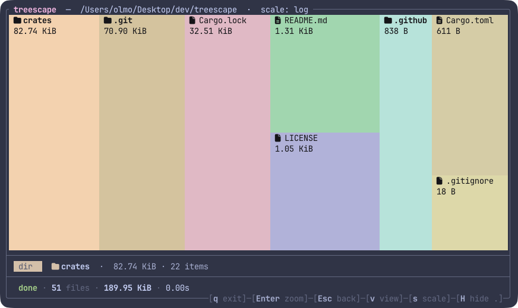

# treescape

[](https://github.com/olmo-francesconi/treescape/actions/workflows/ci.yml)
[](https://crates.io/crates/treescape)
[](LICENSE)

A treemap disk-usage explorer for the terminal.



## Install

```sh
# Homebrew (macOS / Linux)
brew install olmo-francesconi/treescape/treescape

# crates.io (anywhere with a Rust toolchain)
cargo install treescape

# Pre-built binary, no Rust needed (macOS / Linux)
curl --proto '=https' --tlsv1.2 -LsSf \
  https://github.com/olmo-francesconi/treescape/releases/latest/download/treescape-installer.sh | sh
```

Or build from source:

```sh
git clone https://github.com/olmo-francesconi/treescape
cd treescape
cargo install --path crates/treescape
```

## Usage

```sh
treescape ~/Downloads
treescape --hidden ~/Library
```

Hidden files (dotfiles) are always scanned so parent totals stay honest — they're just filtered out of the view by default. Press `H` to toggle them on/off, or pass `--hidden` to start with them visible. When hidden, the title bar shows their total size (e.g. `· 5.2 GiB hidden`).

Symlinks are never followed; they appear as small leaf nodes marked with `→` so you can see they exist without their target's bytes being double-counted.

`treescape` uses [Nerd Font](https://www.nerdfonts.com/) glyphs. Set your terminal to a Nerd Font–patched typeface or icons render as `□`.

## Keys

| Key | Action |
|-----|--------|
| Arrows / `hjkl` | Move selection |
| `Tab` / `Shift+Tab` | Cycle by size |
| `Enter` | Zoom in |
| `Esc` / `Backspace` | Zoom out |
| `v` | Toggle tile / list view |
| `s` | Cycle size scale (log → sqrt → linear) |
| `H` | Toggle hidden files (dotfiles) |
| `q` | Quit |

The bottom border of the app shows the same bindings inline.

## License

MIT
